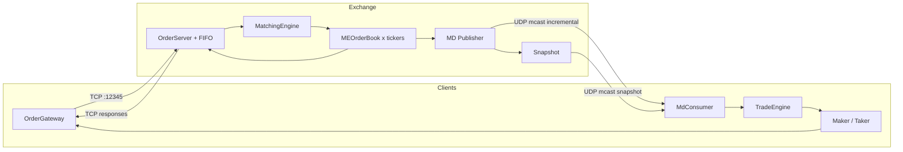
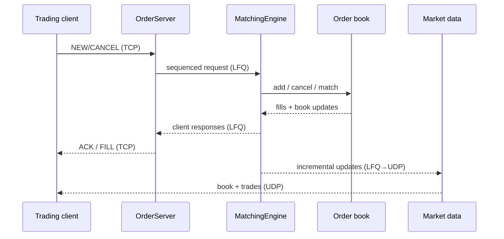
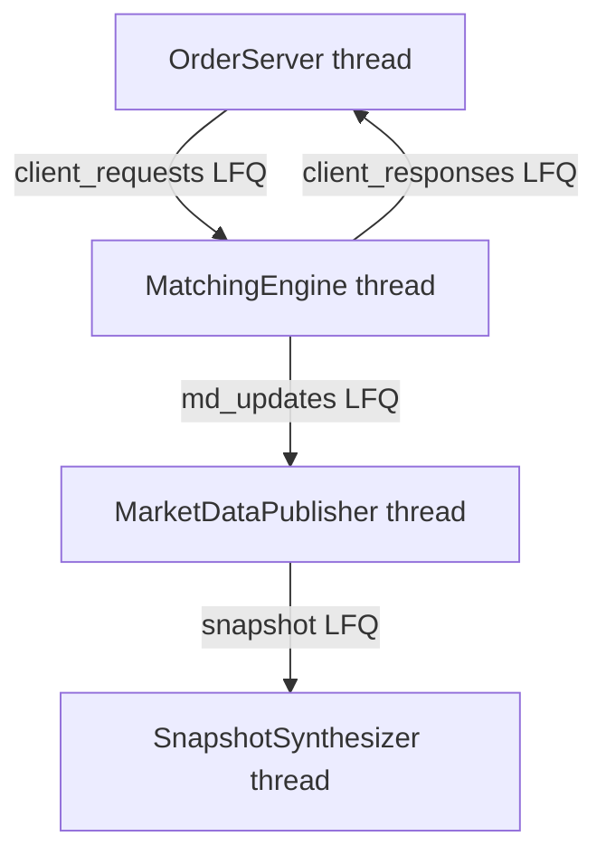

# High-Frequency Trading Exchange Engine

[](https://github.com/ranjan2829/High-Frequency-Trading-Exchange-Engine/actions/workflows/ci.yml)


C++20 teaching / research stack for a **low-latency matching engine**: lock-free queues, price-time order book, TCP order gateway, UDP multicast market data, and sample maker/taker clients.

> **What this is:** a serious educational skeleton of exchange + trading client plumbing.  
> **What this is not:** a production exchange. Latency numbers depend on your machine, build flags, and measurement method — measure yourself (see below).

## Architecture



## Order lifecycle



## Concurrency



SPSC lock-free queues between threads. Matching is **single-threaded across tickers** (deterministic, no lock on the hot path).

## Quick start

```bash
git clone https://github.com/ranjan2829/High-Frequency-Trading-Exchange-Engine.git
cd High-Frequency-Trading-Exchange-Engine

# Option A — CMake (preferred in CI / Linux)
cmake -S . -B /tmp/hft-build -DCMAKE_BUILD_TYPE=Release
cmake --build /tmp/hft-build -j

# Option B — Makefile fallback (macOS-friendly)
make -j

# Run
/tmp/hft-build/exchange_main &          # or ./exchange_main
/tmp/hft-build/trading_main 1 MAKER 10 0.5 100 1000 -10000
```

Demo helper: `./scripts/demo.sh`

### Trading client args

`trading_main CLIENT_ID ALGO [CLIP THRESH MAX_ORDER_SIZE MAX_POS MAX_LOSS]…`

- `ALGO`: `MAKER` | `TAKER` | `RANDOM`
- One config quintuple per ticker (up to 8 tickers)

## Project layout

```
ExchangeMatchingEngine/
  Common/          # LFQ, pools, logging, TCP/UDP
  EXCHANGE/        # matcher, order_server, market_data
trading/           # client strategies, risk, gateways
scripts/demo.sh
```

## Measuring latency (honestly)

1. **In-process book op** — time `MEOrderBook::add` only (warm cache). This can be tens–hundreds of ns on modern CPUs.  
2. **End-to-end fill RTT** — client enqueue → TCP → match → TCP response. Expect microseconds+ on localhost once logging/net are included.  
3. Do **not** treat RANDOM mode’s “avg latency” as exchange RTT — it is local enqueue timing.

## 2026 relaunch highlights

- Clean paths (`ExchangeMatchingEngine/`, no trailing spaces)
- Thread lifetimes retained + joined on stop
- LFQ indices masked / wrapped correctly; full-queue safe
- Safer TCP send (partial send retained), `connect()` check fixed
- Smaller order-id maps for demo-friendly RSS
- Cap on RANDOM loadgen
- CI workflow, MIT license, diagrams, honest metrics note

## License

MIT — see `LICENSE`.
